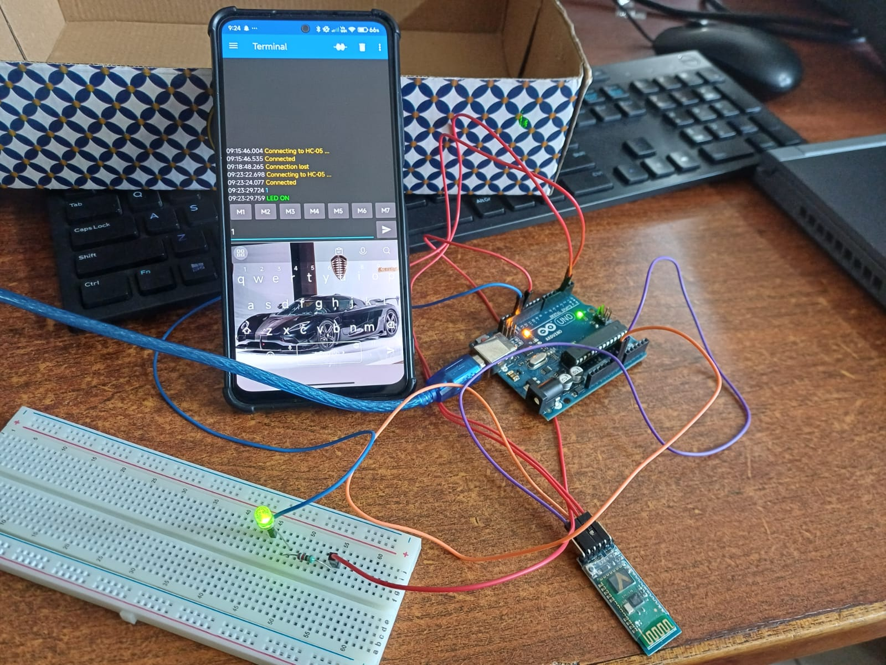

# 🌐 IoT LED Control using Arduino and MQTT Dashboard

## 📌 Description

This project demonstrates IoT-based LED control using Arduino, Bluetooth (HC-05), and an MQTT dashboard mobile application.

---

## 🎯 Objective

* To control devices remotely using MQTT protocol
* To understand IoT communication
* To integrate mobile apps with Arduino

---

## 🛠 Components Used

* Arduino UNO
* HC-05 Bluetooth Module
* LED
* Resistor
* MQTT Dashboard App (Android)

---

## ⚙️ Working

1. User sends ON/OFF command from MQTT dashboard
2. Command is transmitted via Bluetooth (HC-05)
3. Arduino receives command
4. LED is controlled accordingly

---

## 📸 Project Image

---

## 🔌 Connections

### HC-05 → Arduino

* VCC → 5V
* GND → GND
* TX → RX
* RX → TX

### LED → Arduino

* * → D7
* * → GND

---

## 💻 Code

See `code/mqtt_led.ino`

---

## 🚀 Applications

* Smart home automation
* IoT device control
* Remote monitoring systems

---

## 🔥 Future Enhancements

* Use WiFi (ESP8266/ESP32)
* Real cloud MQTT broker (HiveMQ)
* Multiple device control

---

## 👨‍💻 Author

Akhil Charan kumar pujari
